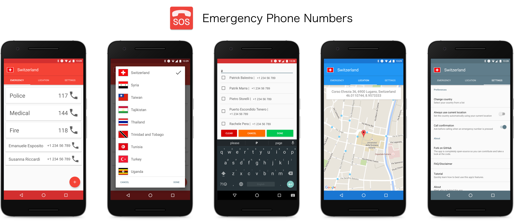

# Emergency Phone Numbers

An Android app that displays the world emergency phone numbers developed @ USI.

This is the final project for our course Programming Fundamentals 2 at [USI](http://www.inf.usi.ch).
The team behind this project is composed by [Patrick Balestra](https://github.com/BalestraPatrick), [Susanna Riccardi](https://github.com/SusannaRiccardi), [Emanuele Giuseppe Esposito](https://github.com/esposem), [Aron Fiechter](https://github.com/Spyridox) and [Valerie Burgener](https://github.com/Shelyo).

#Features
- Store offline more than 130 country's emergency phone numbers
- Add custom contacts from library
- Show location as address and coordinates
- Many customizations
